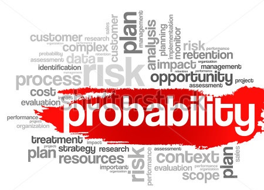

# Probabilidad y variables aleatorias

En estos apuntes se describe el modelo matemático de los fenómenos aleatorios que "soporta" la teoría estadística y que permite construir los modelos estadísticos de una manera rigurosa: la teoría de probabilidades. Se estudiara con profundidad el concepto de variable aleatoria y se presentaran los mas usuales, entre los que destacan por su importancia la distribución normal y sus propiedades. Se presenta la distribución __t__ y también se trata la aproximación de la binomial a la normal como paso previo para presentar el teorema del limite central.

#### Rubén Sánchez Sancho

